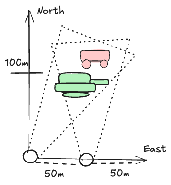

# Sensor Fusion Exercise
Welcome to the EDTH sensor fusion exercise in which you will:
- Set up an array of two camera sensors that are 50 meters apart from each other and observe a 2D map (flat surface)
- Derive an object recognition algorithm to detect and localise a tank and a car in the map
- Implement the core logic for fusing identified objects into a common operational picture

### Setting
We use a local right-handed cartesian coordinate system for which `x` points north and `y` points east. Each camera is facing towards the objects which is configured by the
cameras bearing (or azimuth) angle with 0° bearing = facing parallel north and 90° bearing = facing parallel east.



### Modules
This exercise comprises of 3 modules:
- `sensor.py` defining the camera logic for streaming images
- `object_recognition.py` defining the algorithm to process camera images, detect objects and generate a unique object identification
- `fusion_station.py` defining the central system to fuse identified objects into a shared representation

Main entry point with a step-by-step guide: `main.ipynb`

### Setup
Install required packages via [poetry](https://python-poetry.org/docs/) by executing from the source directory:
```
# Ensure Python >= 3.10 is installed, otherwise you can download with
pyenv install 3.10
pyenv global 3.10

# Install the virtual environment
poetry shell
poetry install
```# Sensor Fusion Exercise